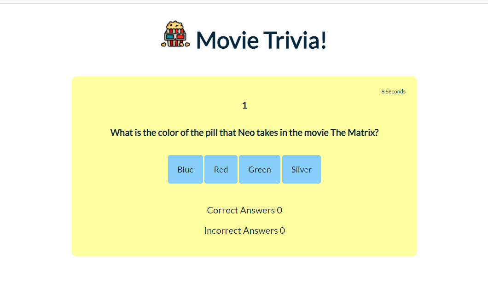
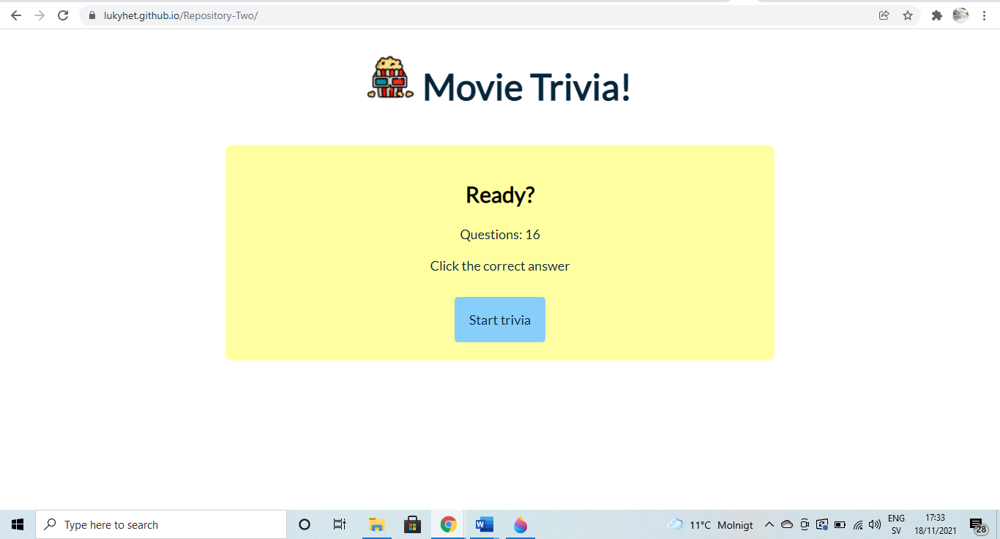
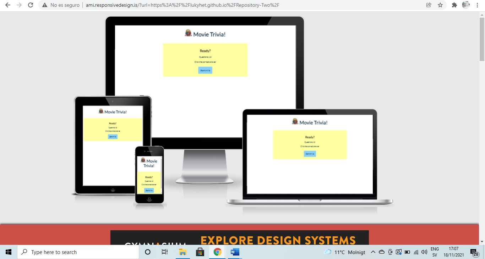

# Movie Trivia!

[View the live project here](https://lukyhet.github.io/Repository-Two/)

## Introduction

Our trivia game is called 'Movie Trivia!'  It was made to provide a fun trivia challenge for those interested in movies. The target audience is those who love movies and want to test their knowledge about them.

Movie Trivia was created for entertainment purposes. It has thirty different questions and displays sixteen of them to the user. The subject of the trivia is “all about movies” and challenges the user’s general knowledge about this topic. When finished, the trivia game shows a table of results that displays the scores of correct and incorrect answers as well as the time taken to answer them.

This Trivia was made as the second milestone project to achieve the Diploma in Software Development at the Code Institute. 

The purpose of this project is the Presentation of interactive data, and the main goal is to build an interactive front-end site that responds to the users' actions, allowing users to actively engage with data, alter the way the site displays the information to achieve their preferred goals.

## UX
###  User Demographic
The user for this website is: 

- Young and adult people who are interested in pop culture and the film indsutry. 
- Those who enjoy playing short games and taking online quizes and trivias.
- Movie lovers or film fans that consider fun to accumulate and test their knowledge about this topic.

#### User Goals

- To have a good time and test the user’s knowledge about movies.
- See an attractive website with contrasting colours as well as a clear design.
- Have clear scores and a timer to be able to assess one's abilities.

## Features 

This is a one page website with a trivia game tha displays a title 'Movie Trivia!', a logo which is a free .png icon made by (https://www.freepik.com) downloaded from (https://www.flaticon.com/). 

The trivia displays sixteen different questions about movies and four answer options, the user is instructed to click the right answer while the timer runs showing how many seconds takes for the user to solve the whole tiriva. At the end of the game the user gets to see a table with the total of questions, the amount of right answers, wrong answers and the total time taken to solve the trivia.

At the bottom, there is a 'try again' button that resets the game and allows the user to get a new chance. The user gets questions in a different order and some new questions mixed. The code contains thirty options of questions and a randomizer to be able to present new options to the user.

All the buttons, the questions and table are easily identifiable by the contrast of the background, lines, and text.

The buttons show a change in the border when pressed so the user can be sure that the button has been clicked.

#### Responsiveness

The game counts with responsive design. 

#### Wireframes
  
My wireframes: 

- Start Page Wireframe - 

- Questions Page Wireframe - 

- Results Page Wireframe - 

    

To sketch an idea on how to make this game I used the following wireframes. I discussed with my mentor from Code Institute Antonio Rodriguez, who listened to my ideas and guided me through the process, at the end the decission was to make a clean quiz about a movies that would include a timer, randomizer and several extra options of answers. I also looked for examples of quizes online as inspiration. 

An example of inspirational site is [Web Dev Simplified](https://www.youtube.com/watch?v=riDzcEQbX6k). 

### Design

#### Colour Scheme

The color palette was chosen by the developer based on the colors of the 'popcorn icon' used as the logo of the Movie Trivia, the background is soft yellow inspired in popcorn, the lines in the table and the comment to the user after finishing the game are red after the red lens in the 3D glasses whereas the light and dark blue hues were selected after the blue lens in the 3D glasses used to watch 3D movies. The colors chosen are hues of the primary colors creating a compatible and harmonious colour scheme. 

#### Typography

The typography selected was the font Lato, that is a well balanced easy to read font imported from [Google Fonts](https://fonts.google.com/). A backup of Sans-Serif is in place in case of main font failure.

## Debugging

Only a couple of bugs were detected by developer tools. One of them was about the comments displayed at the end of the game, below the scores table. 

It should be only one comment displayed at the time and it should be selected according to the user’s score. But two of them were being displayed, the one from the first try and the one from the second try. To fix this the developer needed to make an adjustment adding a 'hidden-content' attribute to the comments, as follows:

`document.getElementById("comment1").classList.add('hidden-content');`

Other types pf bugs detected were related to typos in the javascript code and fixed by correcting it.

### Features to Implement in the future
- **Sounds**
     - During the developing stages of this project to add audio at the begining of the trivia and sounds to the buttons was part of the UX but we need to leave it for a next project as more time is needed.
     

## Main Languages Used

- [HTML5](https://en.wikipedia.org/wiki/HTML5 "Link to HTML Wikipedia")
- [CSS3](https://en.wikipedia.org/wiki/Cascading_Style_Sheets "Link to CSS Wikipedia")
- [JS](https://en.wikipedia.org/wiki/JavaScript "Link to JS Wikipedia")

### Frameworks, Libraries & Programs Used

- [Google Fonts](https://fonts.google.com/ "Link to Google Fonts")
    - Google fonts was used to import the font Lato to style.css file.
- [GitPod](https://gitpod.io/ "Link to GitPod homepage")
     - GitPod was as workspace for writing code,
- [GitHub](https://github.com/ "Link to GitHub")
     - GitHub is being used to store this repository.
- [Flaticon](https://www.flaticon.com/ "Link to Flaticon"). 
     - Flaticon was used to download a free .png icon for the trivia.
- [Am I Responsive?](http://ami.responsivedesign.is/# "Link to Am I Responsive Homepage")
     - Am I Responsive was used to check the responsiveness of the design.
- [W3C](https://validator.w3.org/ "Markup Validation Service")
     - W3C Was used to validate the HTML code.
- [W3C](https://validator.w3.org/ "Markup Validation Service")
     - W3C Was used to validate the CSS code.
- [JShint](https://jshint.com/ "JShint")
     - JShint Was used to validate the JS code.

    
## Testing

The W3C Markup Validator, W3C CSS Validator and JSHint Services were used to validate all the code of this repository and every warning was corrected until the code came up clean in every validator mentioned.

-W3C Markup Validator 

-W3C CSS Validator 

-JSHint javaSrcipt Validator 

## Deployment

This project was deployed in Github [View the live project here](https://lukyhet.github.io/Repository-Two/).

    
## Credits 

### Content

- Some of the questions used in the trivia were taken from 100 Fun Movie Trivia Questions (With Answers) to Stump All Your Film-Loving Friends available in:

    - [Parade](https://parade.com/977752/samuelmurrian/movie-trivia/ "Link to Parade")

- The rest (majority) of the questions were created by the developer.

### Code 

Several sources were consulted and their guides followed, for example:

- The randomizer and other features were made following the guidelines of stackoverflow
- [StackOverflow](https://stackoverflow.com/questions/2450954/how-to-randomize-shuffle-a-javascript-array/ "Link to StackOverflow").
- [Stack Overflow](https://stackoverflow.com/ "Link to Stack Overflow page")
- [W3Schools](https://www.w3schools.com/ "Link to W3Schools page") 

### Media

- The icon used for the logo was downloaded for free from [Flaticon](https://www.flaticon.es/ "Link to Flaticon") 
- The images used in this README.md file were taken by the developer as printscreens or pictures.

## Acknowledgements

- I want to thank and recognize the amazing job of my mentor Antonio Rodriguez who guided me and patiently taught me through the whole project process.
- I also want to mention and thank John from student tutors at Code Institute for taking the time and explaining how to work through the warnings of the JS validator.

[Back to top](#Movie-Trivia!)

***
